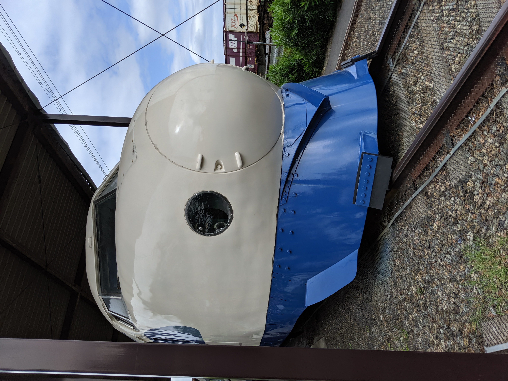
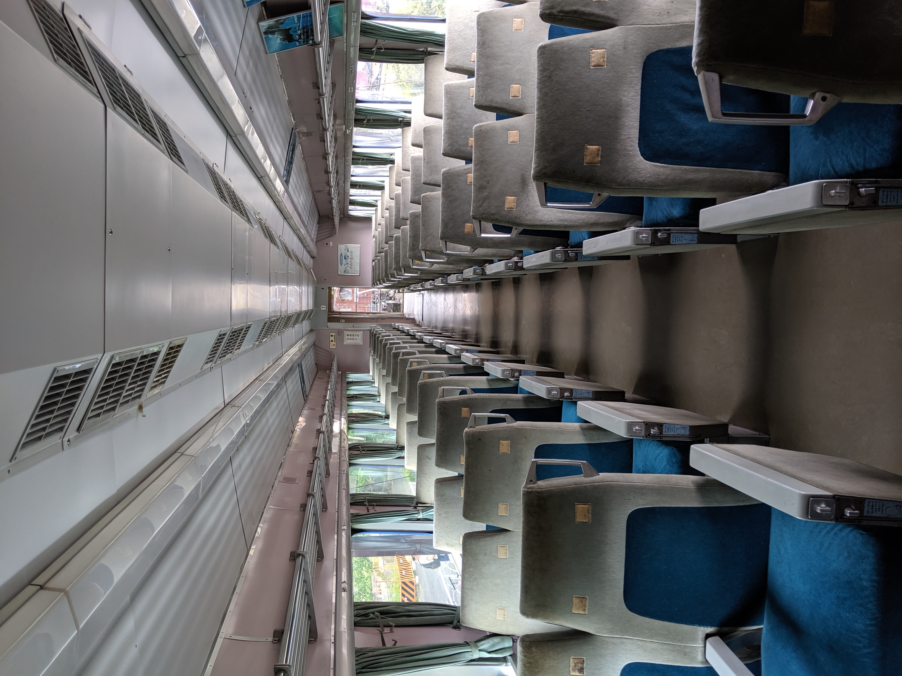
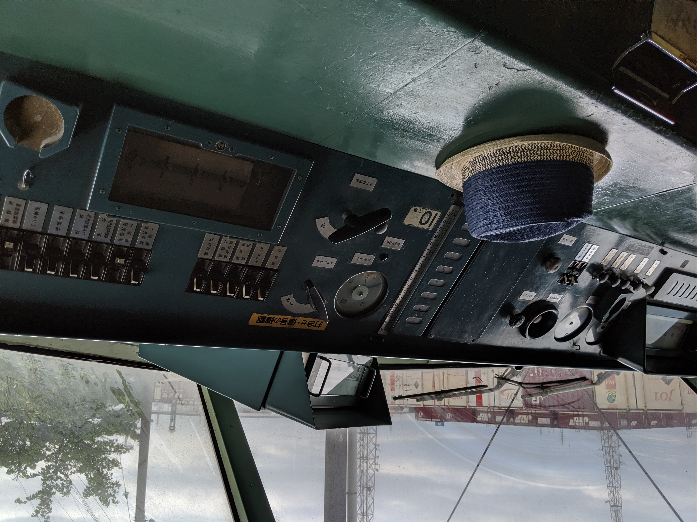

I went to the park named "Shinkansen Park"("新幹線公園") with my family. There is a old Shinkansen (high speed line).

Every sunday between March and May, The inside of it is open to public. We can enter into it. This shinkansen is the first generation called "0 kei" ("0系"). It had been running for over 40 years since 1964. It finished to run in 2008.

The above picture is its driver's seat. My daughter's hat is on it.
The meters, switches and other instruments are manual. There is no displays(e.g. LCD). When I see them, I felt the flow of the times.

## Reference
- [Shinkansen - Wikipedia](https://en.wikipedia.org/wiki/Shinkansen)
- [新幹線公園 - Wikipedia](https://ja.wikipedia.org/wiki/新幹線公園)